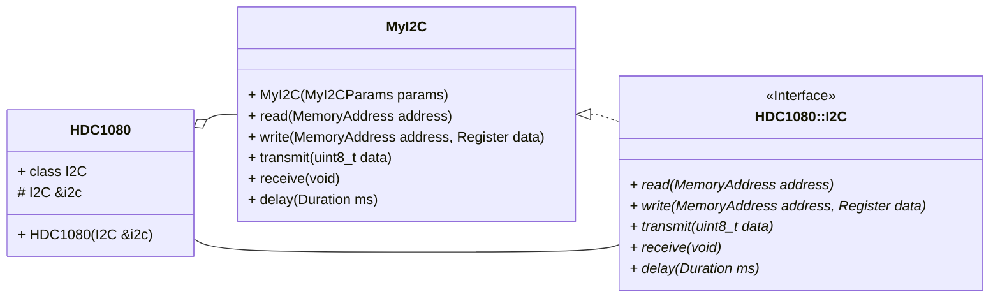

# HDC1080 Temperature and Humidity Sensor Driver

[](LICENCE.md)
[](https://github.com/LawrenceStanton/HDC1080/actions/workflows/codeql.yml)
[](https://github.com/LawrenceStanton/HDC1080/actions/workflows/ctest.yml)

## Overview

The HDC1080 is an embedded temperature and humidity sensor, produced by Texas Instruments, and operates over a I2C digital communications interface. This driver provides a simple C++ object-orientated driver to allow for control and data reception from this device, and is agnostic to any embedded platform.

The design philosophy of this driver is comparatively unique in the embedded systems space. The object orientated approach results in a simple, scalable, and extensible driver, which is easy to use and understand, but respects embedded system limitations and can run on small systems with minimal overhead. The driver is also designed to be agnostic to any embedded platform, and is therefore portable to any embedded system, with any I2C implementation (see [Design Patterns](#design-patterns)). The system also adopts strong unit testing with the [Google Test](https://google.github.io/googletest/) framework, allowing for a high degree of confidence in the driver's operation and ease of further development. CMake also allows for easy integration into parent projects.

## How to Use

### Use as Git Submodule

1. Add this project as a `git submodule`.

    ```zsh
    git submodule add https://github.com/LawrenceStanton/HDC1080 Modules/HDC1080
    ```

2. Build with CMake by adding as a subdirectory.

    ```cmake
    # Add to Your Top-Level CMakeLists.txt
    add_subdirectory(Modules/HDC1080)
    # ...
    target_link_libraries(${YOUR_EXECUTABLE_NAME} PRIVATE 
        HDC1080::HDC1080
    )    
    ```

3. Provide an I2C interface when constructing the driver. Refer to [Design Patterns](#design-patterns) below and [HDC1080.hpp](Inc/HDC1080.hpp) for more information.

4. Construct the derived HDC1080 I2C interface and class object.

    ```cpp
    // Construct the I2C interface
    MyI2C i2cInterface(myParams);
    // Construct the HDC1080 class object
    HDC1080::HDC1080 sensor(&i2cInterface);
    ```

## Design Patterns

This driver follows an [Strategy Design Pattern](https://en.wikipedia.org/wiki/Strategy_pattern) with regards to I2C communication. The driver defines an I2C interface (`HDC1080::I2C`). The user must then provide a concrete implementation of this interface, and provide it to the driver class.



Often a concrete implementation will simply translate the I2C operations to the embedded platform's Hardware Abstraction Layer (HAL). For example, the [STM32Cube HAL](https://www.st.com/en/embedded-software/stm32cube-mcu-mpu-packages.html) provides an I2C interface, which can be used to implement the I2C operations. However, the user may also provide their own low level implementation, which may be useful in some applications, or mocked implementation, which may be useful for testing purposes (see [Testing](#testing)).

### Example

Below is an example of a typical declaration of the I2C interface.

```cpp
#include "HDC1080.hpp"

class MyI2C : public HDC1080::I2C {
public:
    MyI2C(MyI2CParams params) : params(params) {}
    virtual ~MyI2C() {}

    virtual std::optional<HDC1080::I2C::Register> read(HDC1080::I2C::MemoryAddress address) noexcept override final;
    virtual std::optional<HDC1080::I2C::Register> write(HDC1080::I2C::MemoryAddress address, HDC1080::I2C::Register) noexcept override final;
    virtual std::optional<uint8_t> transmit(uint8_t data) noexcept override final;
    virtual std::optional<uint8_t> receive() noexcept override final;
    virtual void delay(Delay delay) const noexcept override final;
}

// Definitions made in a separate source file.
```

Refer to [Examples] for concrete examples of this design pattern.

## Testing

This driver is unit tested using the GoogleTest and GoogleMock frameworks. The tests are located in the [Tests](Tests) directory.

The tests are built using CMake. Given the limitations of many embedded systems, the tests are designed to be run on a host machine, and not on the embedded system itself. This is done by checking the CMake variable `CMAKE_CROSSCOMPILING` and only building the tests if this is false. To build the tests, configure your build presets to perform a local build.

> If gtest and gmock are not installed on your system, CMake will attempt to download and build them automatically with FetchContent. Disable this behaviour by setting the CMake option `HDC1080_AUTOFETCH_GTEST` to `OFF`.
>
> _Command Line:_
>
>```zsh
>cmake -DHDC1080_AUTOFETCH_GTEST=OFF
>```
>
> _Parent CMakeLists.txt:_
>
> ```cmake
> set(HDC1080_AUTOFETCH_GTEST OFF)
> # ...
> add_subdirectory(Modules/HDC1080)
>```

The tests can then be run using CTest.

```zsh
mkdir Build && cd Build
cmake ..
cmake --build .
ctest
```

Run tests automatically be setting `test` as a build target in the CMake presets.

These tests will be included in the parent build if ctest is also used there.
